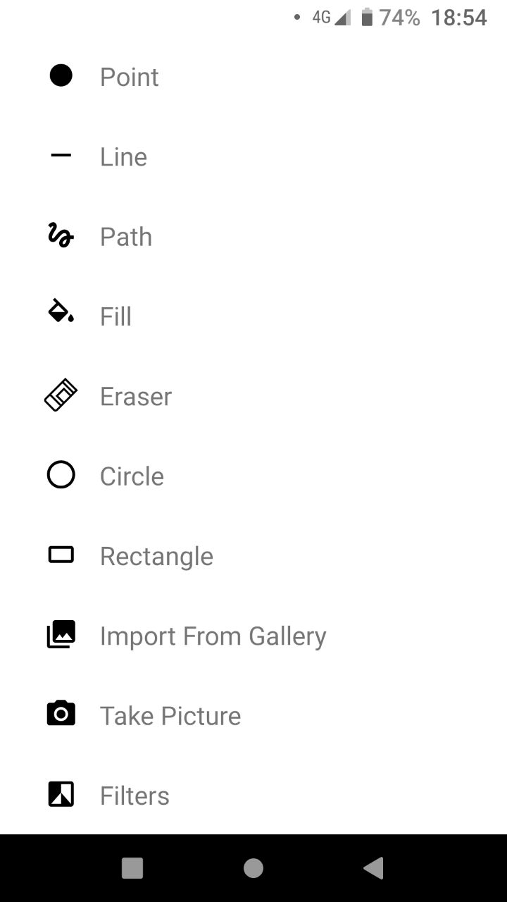
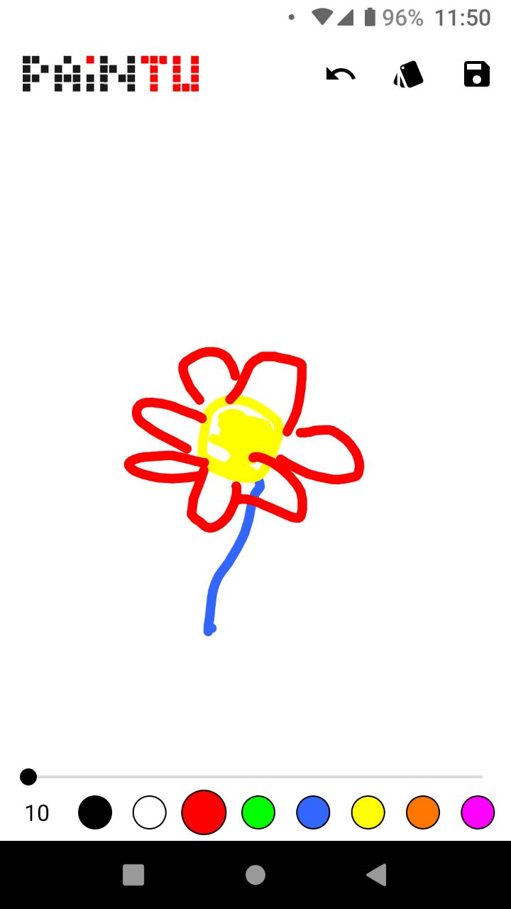

## **PAINTU**

An android drawing app created by desperate students to push theirs and your
creative content creating skills to the next level.

In total 8 different colors are available so far.

This wonderful application provides the following tools:

Draw image on an empty canvas using
* Point
* Line (straight only ;))
* Path
* Fill

* Circle
* Rectangle

or erase a mistake or unwanted garbage with an
* Eraser

You can also import images from your local gallery (please selected them wisely)
or snap a quick picture and draw a small doodle on it.
* Import from gallery
* Take Picture

Even unique filters can be applied ! :)
* Filters

Drawing showcase using the path tool

